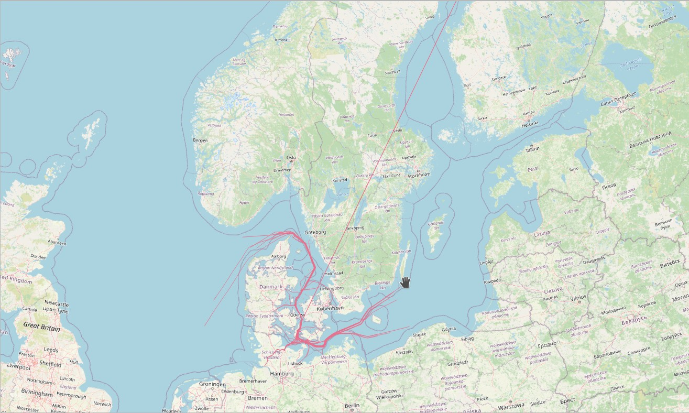

# MobilityDB-JDBC

**Author: Tatiana del Pilar Millan Poveda** 
**Email: tatimilpo@gmail.com**

JDBC driver for MobilityDB has been performed as the Master Thesis of the MSc in Computer Science of ULB.
The original repository can be found [here](https://github.com/tatimilpo/MobilityDB-JDBC/).   
A report with the detailed information is available [here](https://docs.mobilitydb.com/pub/MobilityDB-JDBC.pdf) or in 
this [folder](https://github.com/tatimilpo/MobilityDB-JDBC/tree/main/files) and the slides 
[here](https://docs.mobilitydb.com/pub/MobilityDB-JDBC-slides.pdf).

## Abstract
The purpose of this project is the creation of Java Database Connectivity Driver (JDBC) that helps programs written in Java to connect with MobilityDB databases by extending PostgreSQL JDBC types. MobilityDB is an open-source database management system extension of PostgreSQL, that offers support for object moving data and special temporal data.
The MobilityDB-JDBC driver provides support for the new MobilityDB  types: Period, PeriodSet, TimestampSet, TBox, STBox , TInt, TBool, TFloat, TText, TGeomPoint and TGeogPoint and also the temporal types TInstant, TInstantSet, TSequence and TSequenceSet, and was built based on the MobilityDB Python adapter with the objective of acquire feature parity.

## Development
### Requirements
- Java >= 11
- Docker

### Build
The project is using Gradle for building and Maven for the dependencies, but it is not required to install any of them, it is possible to build the project by running the following command on the root folder:
 
On Linux:

    ./gradlew build
On Windows:

    gradlew.bat build
    
To just execute the unit tests:

On Linux:

    ./gradlew test
On Windows:

    gradlew.bat test

### Code Analysis 
To run the code analysis it is required to have a project configured on Sonarqube and then execute the command:

On Linux:

    ./gradlew sonarqube -Dsonar.projectKey={project key} -Dsonar.host.url={host} -Dsonar.login={token}
On Windows:

    gradlew.bat sonarqube -Dsonar.projectKey={project key} -Dsonar.host.url={host} -Dsonar.login={token}

#### Sonarqube Docker Image
To configure the Sonarqube project it is recommended to run the docker image.
For more details check [the Sonarqube setup guide.](https://docs.sonarqube.org/latest/setup/get-started-2-minutes/)

Download the docker image:

    docker pull sonarqube
    
Run the image for the first time:

    docker run -d --name sonarqube -e SONAR_ES_BOOTSTRAP_CHECKS_DISABLE=true -p 9000:9000 sonarqube:latest

Run the image after a restart:

    sudo docker start sonarqube

Once the image is running open http://localhost:9000  in a browser and login using:
- User: admin
- Password: admin

Create a new project
- Set project key and display name e.g MobilityDB-JDBC
- Select the option to analyze locally
- Generate a token e.g 1234
- Select Gradle for the option that describes the build
- Copy the gradle command and execute it, e.g:

   
    ./gradlew sonarqube -Dsonar.projectKey=MobilityDB-JDBC -Dsonar.host.url=http://localhost:9000 -Dsonar.login=1234
    
- Review the results on Sonarqube
### Running Integration Tests
To run the integration tests it is required to have a PostgreSQL database with MobilityDB extension.
The integration tests uses the connection string:
    
    jdbc:postgresql://localhost:25432/mobilitydb
    
but it can be modified in BaseIntegrationTest class.
To execute them run the command:

On Linux:

    ./gradlew integrationTests
On Windows:

    gradlew.bat integrationTests

#### MobilityDB Docker Image
It is recommended to run the MobilityDB docker image for the integration tests.
For more details check https://github.com/MobilityDB/MobilityDB#docker-container

    docker pull mobilitydb/mobilitydb
    docker volume create mobilitydb_data
    docker run --name "mobilitydb" -d -p 25432:5432 -v mobilitydb_data:/var/lib/postgresql mobilitydb/mobilitydb
### Generating Javadocs
The documentation for the classes could be found in the folder [docs](https://github.com/tatimilpo/MobilityDB-JDBC/tree/main/docs).
In case it is needed to generate again the documentation, run the following command:

On Linux:

    ./gradlew javadoc
On Windows:

    gradlew.bat javadoc
    
It will generate the documentation under the folder **mobilitydb-jdbc\build\docs**.

## Running The Examples
### Playground
Playground class can be used to test queries and check the correct data type is used.
To execute it is required to have a database with MobilityDB extension. 
For example using the [MobilityDB docker image](https://github.com/MobilityDB/MobilityDB#docker-container)
        
    docker pull mobilitydb/mobilitydb
    docker volume create mobilitydb_data
    docker run --name "mobilitydb" -d -p 25432:5432 -v mobilitydb_data:/var/lib/postgresql mobilitydb/mobilitydb

Then verify that the connection is created with the correct configuration:

    Connection con = Common.createConnection(25432, "mobilitydb")
    
Finally, to execute it with gradle run:

    ./gradlew -PmainClass=com.mobilitydb.example.Playground run
### Workshop
The workshop example is based on [MobilityDB workshop](https://github.com/MobilityDB/MobilityDB-workshop)
It uses MobilityDB-JDBC to create the ship rows and read them to set the trajectories. 
To execute, it is required to have the workshop docker image:

    docker pull mobilitydb/mobilitydb:12-2.5-develop-workshop
    docker volume create mobilitydb_data_workshop
    docker run --name "mobilitydb_workshop" -d -p 25433:5432 -v mobilitydb_data_workshop:/var/lib/postgresql mobilitydb/mobilitydb:12-2.5-develop-workshop 

Also, it is required to have the database DanishAIS created, with the MobilityDB extension:

    CREATE EXTENSION MobilityDB CASCADE;

Then, execute it with Gradle run:

    ./gradlew -PmainClass=com.mobilitydb.example.Workshop run

Finally, the generated trajectories can be displayed on QGIS, as in the image below:  
