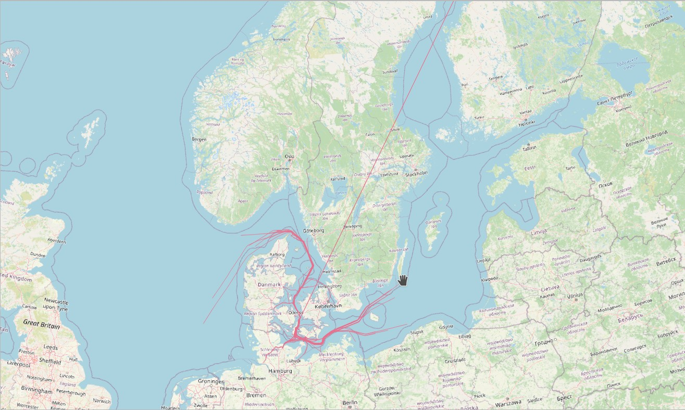

# MobilityDB-JDBC Example
## Playground
Playground class can be used to test queries and check the correct data type is used.
To execute it is required to have a database with MobilityDB extension. 
For example using the [MobilityDB docker image](https://github.com/MobilityDB/MobilityDB#docker-container)
        
    docker pull mobilitydb/mobilitydb
    docker volume create mobilitydb_data
    docker run --name "mobilitydb" -d -p 25432:5432 -v mobilitydb_data:/var/lib/postgresql mobilitydb/mobilitydb

Then verify the connection is created with the correct configuration:

    Connection con = Common.createConnection(25432, "mobilitydb")
    
Finally, to execute it with gradle run:

    ./gradlew -PmainClass=com.mobilitydb.example.Playground run
## Workshop
The workshop example is based on [MobilityDB workshop](https://github.com/MobilityDB/MobilityDB-workshop)
It uses MobilityDB-JDBC to create the ship rows and read them to set the trajectories. 
To execute it is required to have the workshop docker image:

    docker pull mobilitydb/mobilitydb:12-2.5-develop-workshop
    docker volume create mobilitydb_data_workshop
    docker run --name "mobilitydb_workshop" -d -p 25433:5432 -v mobilitydb_data_workshop:/var/lib/postgresql mobilitydb/mobilitydb:12-2.5-develop-workshop 

Also, have the database DanishAIS created with the MobilityDB extension:

    CREATE EXTENSION MobilityDB CASCADE;

Then to execute it with gradle run:

    ./gradlew -PmainClass=com.mobilitydb.example.Workshop run

Finally, the generated trajectories can be displayed on QGIS:  
